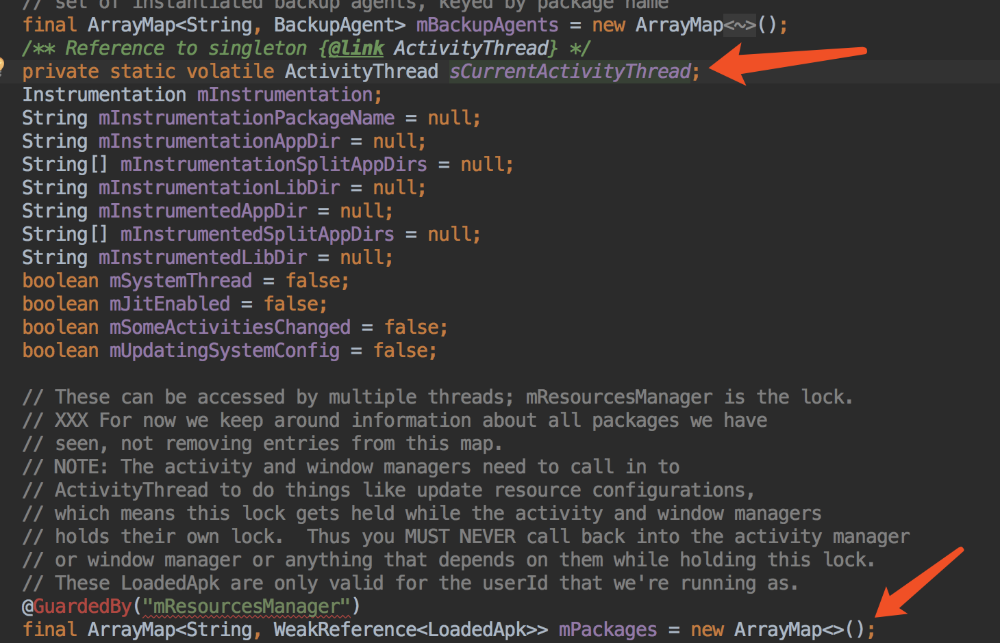
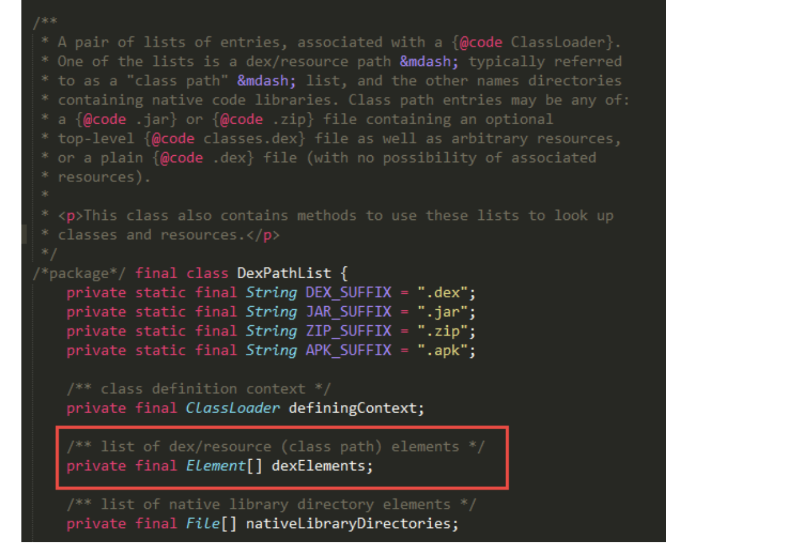

# 插件化开发入门

## android中的类加载器

安卓中的类加载器是在java类加载器的基础上的修改，主要是两个加载器：

* PathClassLoader
* DexClassLoader

他们都是基于`BaseDexClassLoader`的实现类，主要的区别是支持加载的文件的不同。

* DexClassLoader可以加载任何路径的zip/apk/dex/jar，并且会在指定的output路径下释放出apk等中dex文件
* PathClassLoader只能加载apk/dex，也就是已经安装到手机中的apk（安装的apk会在data/dalvik-cache里缓存dex文件）

**PathClassLoader是默认的类加载器**

> DexClassLoader

```java
public DexClassLoader (String dexPath, String dexOutputDir, String libPath, ClassLoader parent)
```

参数详解：

* dexPath：dex文件路径列表，多个路径使用”:”分隔 
* dexOutputDir：经过优化的dex文件（odex）文件输出目录 
* libPath：动态库路径（将被添加到app动态库搜索路径列表中） 
* parent：这是一个ClassLoader，这个参数的主要作用是保留java中ClassLoader的委托机制（优先父类加载器加载classes，由上而下的加载机制，防止重复加载类字节码）

> PathClassLoader

```java
public PathClassLoader (String path, ClassLoader parent)
public PathClassLoader (String path, String libPath, ClassLoader parent)
```

参数详解：

* path：加载apk的文件路径
* libPath：apk文件中包含lib库的目录
* parent：同上

> 为什么DexClassLoader能加载更多类型的dex文件？

主要的原因是在PathClassLoader本身就没有去解压缩文件，导出dex的功能，代码如下：

```java
private static DexFile loadDexFile(File file, File optimizedDirectory)
            throws IOException {
        if (optimizedDirectory == null) {
            return new DexFile(file);
        } else {
            String optimizedPath = optimizedPathFor(file, optimizedDirectory);
            return DexFile.loadDex(file.getPath(), optimizedPath, 0);
        }
    }
```
由于PathDexClassLoader是没有提供optimizedDirectory的，随意直接走到了上面的if语句中。

> android中的各个类的加载器是否一样？

通过一个demo来看下：

```java
Log.i("111", "安卓系统类加载器:"+Context.class.getClassLoader());
Log.i("111", "一般应用程序加载器:"+getClassLoader());
Log.i("111", "系统应用加载器:"+ClassLoader.getSystemClassLoader());
```
* 安卓系统类的加载器是：java.lang.BootClassLoader
* 一般应用程序的类加载器是：dalvik.system.PathClassLoader[DexPathList[[zip file "/data/app/giant.dynamic-1/base.apk"],nativeLibraryDirectories=[/data/app/giant.dynamic-1/lib/arm64, /system/lib64, /vendor/lib64, /system/vendor/lib64, /product/lib64]]]
* 系统应用的类加载器是：dalvik.system.PathClassLoader[DexPathList[[directory "."],nativeLibraryDirectories=[/system/lib64, /vendor/lib64, /system/vendor/lib64, /product/lib64, /system/lib64, /vendor/lib64, /system/vendor/lib64, /product/lib64]]]

**可以看出，虽然任何应用的加载器都是PathClassLoader，但是他们加载资源路径是不同的，一般应用加载的路径是/data/app/xxx.apk了，而是系统apk的路径：/system/app/xxx.apk，对应的lib库路径也是不同的**

## 打开插件的四大组件

四大组件涉及到了启动流程和生命周期，因此简单的通过DexClassLoader去loadClass，通过intent是无法启动的。

### 方式1：替换LoadedApk中的mClassLoader

让加载进来的Activity有启动流程和生命周期。主要的思路：



1. 反射ActivityThread类中的currentActivityThread方法，获取当前的ActivityThread线程对象；
2. 从ActivityThread对象中获取到mPackages属性，这是个包名和LoadedApk之间建立关联关系的Map对象
3. 然后根据packageName获取到LoadedApk对象，修改其中的mClassLoader属性

### 方式2：合并PathClassLoader和DexClassLoader中的dexElements数组

主动的将dex的信息加入到加载路径中。因为PathClassLoader和DexClassLoader都是继承自BaseDexClassLoader，而dex资源的保存都是在DexPathList对象中。



主要的做法：

1. 分别得到PathClassLoader和DexClassLoader中的dexElements字段
2. 然后合并
3. 将合并后的dexElements字段重新赋值给PathClassLoader，这样PathClassLoader就拥有了插件apk的dex资源

> 两种方式的总结

方式1主要是将系统默认的PathClassLoader替换成自己生成的DexClassLoader，通过ActivityThread作为入口，最终找到mClassLoader对象进行修改；

方式2则不修改系统默认的PathClassLoader（**不确定上面的修改是否有副作用**），只是将新的dex加入到系统默认加载器的dexElements里。

### 方式3：宿主代理的方式

这个的方式主要的做法是：

* 将宿主组件注入到插件中，使得插件能引用到宿主的对象
* 插件ui展现，生命周期的回调都是通过宿主来管理

**插件的特点是插件里的组件已经不是真正意义上的组件了，生存完全依赖于宿主。**

### 加载方式的比较

方式1、2其实是一种方式，原理是一样的，主要依赖于反射的机制。优点：插件的组件跟正常加载的组件性质是一样的，不用特意的关心插件里的生命周期；缺点：插件的组件必须在宿主的工程中申明，就是插件与宿主之间存在一定的耦合

方式3是代理的方式，优点：不需要在宿主申明插件的组件，只需要生命代码activity就ok，耦合性降低了；缺点：需要在宿主中管理插件中的组件的生命周期，复杂度升高。

### 方式4：Hook Activity的启动过程

由于上面的方式都或多或少的存在一些问题，能有一种方式即不用再AndroidManifest.xml里注册，同时也不需要管理插件的生命周期呢？

答案是有的，主要是根据Activity的启动流程，在中间过程中绕过AndroidManifest.xml注册的检查，就是“瞒天过海+借尸还魂”。

具体的一个做法是：

1. 这个方式同样需要将dex注入，所以需要依赖方式1或方式2
2. 将跳转的目标activity替换掉
 * 得到ActivityManager类/ActivityManagerNative类中的IActivityManagerSingleton对象/gDefault对象
 * 从上面的对象中获取到IActivityManager接口定义

